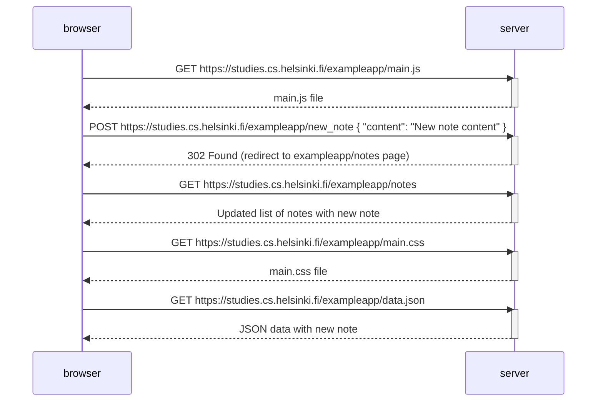

```mermaid
sequenceDiagram
    participant browser
    participant server

    %% Tiedostojen lataus sivun avaamisen yhteydessä
    browser->>server: GET https://studies.cs.helsinki.fi/exampleapp/main.js
    activate server
    server-->>browser: main.js file
    deactivate server

    %% Käyttäjän toiminta uuden muistiinpanon luomiseen
    browser->>server: POST https://studies.cs.helsinki.fi/exampleapp/new_note { "content": "New note content" }
    activate server
    server-->>browser: 302 Found (redirect to exampleapp/notes page)
    deactivate server

    %% Ohjaus ja uuden muistiinpanon hakeminen
    browser->>server: GET https://studies.cs.helsinki.fi/exampleapp/notes
    activate server
    server-->>browser: Updated list of notes with new note
    deactivate server
    
    browser->>server: GET https://studies.cs.helsinki.fi/exampleapp/main.css
    activate server
    server-->>browser: main.css file
    deactivate server

    browser->>server: GET https://studies.cs.helsinki.fi/exampleapp/data.json
    activate server
    server-->>browser: JSON data with new note
    deactivate server

```
